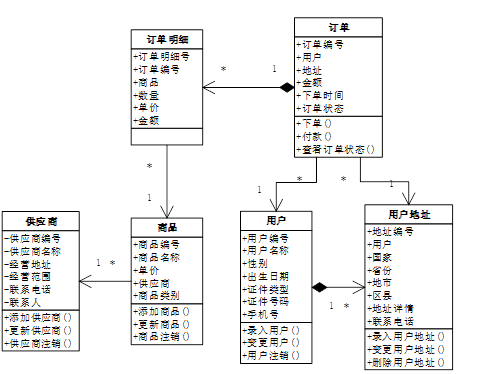

# 支持DDD的低代码平台
这是一个Demo代码，演示了通过使用低代码平台来支持DDD领域驱动设计，使DDD落地软件项目更加容易，编写代码更少，
变更维护成本更低，使软件开发人员能够将更多的精力专注于学习业务领域知识、进行业务领域建模、设计出更加专业、用户
体验更好的软件系统。除此之外，还有几个Demo项目演示通过使用低代码平台设计DDD+微服务，这些项目清单如下：
```
edev-ddd-monolith   采用低代码平台编写的单体应用
* edev-ddd-support    支持DDD领域驱动设计的低代码平台
* edev-ddd-trade      采用低代码平台编写的业务操作系统
* edev-ddd-analysis   采用低代码平台编写的查询分析系统
edev-service-trade  采用低代码平台编写的微服务系统 for eureka
edev-alibaba-trade  采用低代码平台编写的微服务系统 for nacos
edev-consul-trade   采用低代码平台编写的微服务系统 for consul
```
为什么需要这样的低代码平台呢？因为DDD发展了这么多年，最大的难题是落地实际项目困难，代码编写量巨大。
正因为如此，使得DDD落地阻力巨大，困难重重，始终不能发挥出DDD应有的作用。
本人另辟蹊径，进行了这样一个尝试，能不能通过低代码平台，简化DDD的编码，让DDD更加容易落地。
希望这样的尝试能够抛砖引玉，给尝试落地DDD的团队带来一个全新的思路。

## 落地实践DDD的难题是什么呢？
2004年，软件大师Eric Evans发表了他的不朽著作《领域驱动设计》。这本书2006年就引入到中国，但在过去十多年时间
都没有泛起多少浪花，鲜有团队能坚持采用领域驱动来设计系统。回顾过去的这么多年，领域驱动设计为什么没有火起来呢？
大家普遍的感觉是，它的设计思想确实是个好东西，但最终要落地到实际项目中却非常困难，成本太高。

然而，这些年随着软件业的不断发展，软件系统开始变得越来越庞大而难于维护，同时又要面对互联网高并发压力的冲击，越来
越多的团队开始实践微服务架构。这时，领域驱动设计（Domain Driven Design，简称DDD）又开始为越来越多人所关注。
诚然，受到越来越多人的关注是一件好事，但这并不意味着它过去的问题都得到了解决。在过去那么多年都没有火起来，固然有
一些历史的因素制约，但究其本身必然有一些问题没有得到解决，使得我们实践起来成本很高、困难很大。我认为当务之急就是要
进行改革，做出改变，解决DDD落地困难的问题。只有这些问题解决了，让越来越多的团队在实际项目中把DDD实践起来了，让DDD
真正落地，提高IT产业的设计质量，才能把领域驱动设计发扬光大。

那么，落地实践DDD的难题是什么呢？这首先要从领域驱动设计的灵魂技——领域建模——说起。
### 领域模型是领域驱动的灵魂技能
《领域驱动设计》这本书一开篇就讲了，软件的本质是对真实世界的模拟，因此软件设计就是应该与真实世界对应起来。真实世界
是什么样子，软件就应该怎样设计。这种对应关系体现在以下3个方面：

1. 真实世界有什么事物，软件世界就有什么对象；
2. 真实世界中这些事物有什么行为，软件世界中这些对象就有什么方法；
3. 真实世界中这些事物间有什么关系，软件世界中这些对象间就有什么关联；

正因为如此，领域驱动设计就要求研发团队在软件设计之初，首先应当通过深刻地理解业务需求，深入理解业务领域知识，然后将
这些对业务领域知识的理解形成领域模型。譬如，要设计电子商务系统的订单功能，你首先要理解“用户下单”这个业务场景的业务
领域知识。在这个业务场景中都有哪些业务对象呢？首先有订单，每个订单对应一个用户，但一个用户可以下多个订单，它们之间是
多对一关系。一个用户可以有多个用户地址，但一个订单只能对应其中一个用户地址。一个订单对应多个订单明细，每个订单明细
对应一个商品……就这样，我们将我们对业务的理解绘制成领域模型，然后通过这个领域模型来指导软件开发。



在以往，很多团队基于业务绘制领域模型，完成这个步骤都是没有问题的。然而，绘制领域模型不是我们最终的目的。我们最终的
目的是要通过领域模型的设计去指导软件开发。那么，这个领域模型又该如何指导软件开发呢？

### 领域模型是怎样指导软件开发的？
领域模型的落地实际上包含2部分的设计：数据库设计与程序设计。程序设计就是将领域模型的原貌落实到软件设计中。譬如，用户
在下单时，提交了一个订单，前端UI就会将订单以Json的形式提交到后台。接着，后台接收这个Json以后，就会产生一个“订单”
对象，将Json数据写入到该对象中。这时，这个“订单”对象就是基于领域模型设计的领域对象。

在前面设计的领域模型中，“订单”对象有3个关联对象：用户、用户地址和订单明细。用户和用户地址与订单对象的关联关系都是
多对一关系，因此在订单对象中分别有2个属性是用户和用户地址；订单明细与订单对象的关联关系是一对多，因此在订单对象中订单
明细是一个集合变量，它被设计成一个Set或List。

有了领域对象，用户下单的行为又应该如何处理呢？这里就出现了两种完全不同的设计分歧：充血模型与贫血模型。充血模型要求所有
的业务处理都在领域对象中，Service只是接收用户的下单请求；贫血模型要求所有的业务处理都在Service中处理，领域对象仅仅
只有各种属性与其携带的数据。我认为，按照中国人中庸的思想，完全的充血模型或贫血模型都是不对的，应当将它们结合。如接收
请求、校验数据、执行业务逻辑与最终的保存应当交给Service，而领域对象中的一些核心的业务及其关系应该交给领域对象，如获取
订单时间、数据格式转换、维持订单明细与订单数据关系，等等。

最后，当完成了所有的业务操作以后，保存订单。保存订单前的所有操作都是在订单对象中进行的，与数据库无关，保存订单时才写入到数据库中。
这时，数据库应当设计什么表来存储领域对象呢？数据库设计实际上就是领域对象的持久化，也就是将最终的数据持久化存储到数据库中，
或者从数据库中查询并展示数据。

表面上看，数据库持久化很简单，就是将一个一个领域对象对应到数据库的表，其实不然。譬如，要将“订单”对象保存到数据库中，
就是设计一个订单表来保存吗？不是的。“订单”对象关联了好几个关联对象，如用户、用户地址、订单明细，保存订单时是否要
同时保存哪些数据呢？这时就必须要引入一个非常重要的概念：聚合。聚合代表的是一种整体与部分的关系，如订单与订单明细在
业务上是一种整体与部分的关系，因此在保存订单时应当同时保存订单明细，并把它们做到同一个事务中。而相反的是，订单与用户、
用户地址不是聚合关系，因此在保存订单时不会保存它对应的用户和用户地址。

除了保存，我们对数据库的操作还有查询。当用户要查询某张订单时，我们不是仅仅只查询订单表，而是在查询订单表的同时，查询
与之关联的用户表、用户地址表、订单明细表，最后装配成一个完整的订单对象。

除此之外，领域对象间的关系还有继承关系，但数据库没有这种关系。因此，如何将继承关系持久化也是一个需要解决的设计难题。
通常地，领域对象的继承关系在持久化时，可以根据不同的情况选择3种不同的数据库设计方案。

综上所述，从领域模型落地到软件开发，我们需要做这么多事情。而在做这些事情的过程中隐藏了诸多的设计难题。以往的团队在
实践DDD的过程中，在面对这些问题时，往往不知该怎么办，或者解决起来非常繁琐与麻烦。如果开发团队在坚持领域驱动设计的过程
中总是在面对这些难题，DDD实践就会遇到诸多阻力，慢慢地只有选择放弃，最后无疾而终，这就是“DDD之殇”。

### DDD落地要解决哪些设计难题？
通过前面的梳理，我们了解了领域驱动设计落地软件开发要经历的过程。然而，在这个过程中开发团队会遇到哪些难题呢？
#### 1) 从Json到领域对象该如何转换？
每个业务功能提交的Json都是不一样的，提交以后要转换成的领域对象也是不一样的。过去怎么来解决这种不一样呢？就是为每个
功能写Controller，把每个Json中的每个属性都取出来，然后塞入到对应的领域对象的每个属性中。这样的做法无疑需要编写
大量的代码，让DDD的开发非常繁琐而难于落地。我们希望有一个通用程序，直接将对应的Json转换成对应的领域对象。
这样，我们就不用写那么多Controller的代码，而是把更多精力放在Service与Entity的业务代码编写上。

#### 2) 领域对象该怎么持久化？
每个领域对象都有很多属性，持久化时如何将其保存到数据库表的各个字段中呢？过去，我们需要为每个表编写一个Dao，然后
为其编写insert, update, delete, select等语句，开发工作也是相当繁琐。这里能不能只配置一次，将领域对象对应
的表，各属性对应的字段，都建立对应关系。有这样的一次配置，就能够简化后面一系列繁琐的开发工作，让DDD落地开发变得轻松。

#### 3) 领域对象间的关系该如何表示？
将领域模型最终要落实到程序设计中，就是将领域模型的原貌，最后落实到领域对象的设计，以及维护领域对象间相互的关联关系。
譬如，将领域模型落实到“订单”对象的设计，“订单”对象中有用户、用户地址、订单明细等属性，对应到相应的领域对象上。
然而，这样的设计将领域模型中的关系描述清楚了吗？其实没有。比如“订单”对象中有个“用户”属性，指向“用户”对象，这个关系
就描述清楚了吗？没有，这个关系既可能是一对一关系也可能是多对一关系。“订单”对象中有关“订单明细”属性指向“订单明细”对象的
集合，这个关系描述清楚了吗？也没有，它们既可能是一对多关系，也可能是多对多关系，它们是否有聚合关系呢？所以，我们必须在
领域对象设计的基础上，通过一个DSL（Domain Specific Language，领域特定语言）对其进行补充说明。

#### 4) 聚合关系该怎么处理？
聚合关系是DDD独创的一个设计，它将真实世界中那些整体与部分的关系，用整体来封装部分。如订单是整体，订单明细是部分，它们
是一个典型的聚合关系。因此，在整个订单管理的过程中，始终是将订单作为一个整体来进行操作。譬如，前端提交的时候是将订单
作为一个整体来提交，订单明细只是订单中的属性；后台完成下单等操作流程时，也是将订单作为一个整体来进行操作。最后要保存
订单时，Service是将订单作为整体来保存，但底层Dao要同时保存订单表和订单明细表，并把它们做成同一事务。这时，底层Dao
该如何设计呢？过去，我们要为每个模块设计Dao，这样的设计开发同样非常繁琐。现在，我们希望通过一个通用的Dao就搞定这事儿，
我们只需要在DSL中进行配置。

#### 5) 领域对象该如何查询？
当领域对象通过持久化存储到数据库中以后，紧接着就是数据查询。譬如，当用户完成下单操作以后，紧接着就开始通过查询跟踪
订单状态。过去我们对订单的查询，不仅要通过SQL语句查询订单表，还要join用户表、用户地址表以及订单明细表。但这样的
查询非常不DDD，最后得到的结果集不是一个一个的领域对象，而是一个一个Map。这样别扭的设计常常会带来后续诸多糟糕的设计。
因此，我们希望DDD的查询最终得到的是由领域对象组成的结果集。

按照这样的思路，我们首先查询订单表而不进行join操作。我们将这样的查询操作交给DDD工厂来做，如订单工厂。这时，订单工厂
不仅要查询订单表，还要检查订单对象的关联关系，将与订单相关的用户、用户地址及订单明细也查询出来，最后将它们装配成一个个
完整的领域对象。

按照这样的思路就意味着，今后所有的查询都必须要设计一个与之对应的DDD工厂来完成这个装配工作，而设计这么多工厂将是一个
非常繁杂而量大的工作。因此我们希望能有一个通用的工厂来完成这个工作：当我们通过DSL将领域对象间的关系描述清楚以后，
只要查询订单就能在底层自动装配与订单对应的用户、用户地址与订单明细，而不需要我们编写太多额外的代码。底层通用DDD工厂
的设计，也是将DDD落地软件开发一个非常重要的环节。

#### 6) 继承关系该如何处理？
继承关系的处理又是DDD落地的另一个设计难题。在领域模型设计中，领域对象之间是有继承关系的，但将其持久化到数据库设计时
是没有继承关系的。因此，这里有2个设计难题：

1) 当用户从前端提交Json对象时，能够正确地识别并将其转换成对应子类的领域对象。譬如，在领域模型中，VIP会员按照继承关系
被分为金卡会员与银卡会员。这时，当用户从前端提交一个会员的Json对象时，我们希望能够自动将其识别为是金卡会员对象，还是银卡会员对象。
2) 我们在Service中进行了一系列设计以后，最终要保存到数据库中，又该怎么设计呢？将继承关系持久化到数据库中，根据业务情况
有三种设计思路：将整个继承关系存储到一张表中、将每个子类存储到各自的表中、父类与子类分别存储到不同表中。这时，我们希望通过
在DSL中适当描述，继承关系就能够自动存储到数据库中，简化数据库的设计。

为了实现以上2个设计难题，显然DDD的底层需要有一个框架来自动处理以上这些问题，让DDD的落实实践轻松而易于理解。

## 解决DDD设计难题的思路
前面通过一系列的分析，我们理解了实践DDD要不得不面对的设计难题。那么解决这些难题的设计思路又是什么呢？通过前面的分析，
相信大家一定能感受到，解决这些难题最有效的思路就是提供一套支持DDD的低代码平台。这个低代码平台在底层通过一系列的封装，
将DDD实践中许多繁琐的操作，都封装成一些通用的代码。有了这些封装，开发团队就能够从这些繁琐的操作中解脱出来，将更
多的精力专注于深刻地理解业务领域知识，最后设计出更加专业的、更解决用户痛点、给用户更好体验的软件系统。这时，DDD才能
真正发挥出它的优势，真正落地到项目中。

### 支持DDD的低代码平台架构
低代码平台是通过一定的规则引擎或模板，有效地降低开发人员的代码编写量，使其能够将更多的精力专注于业务领域的理解与业务
功能的设计。那么低代码平台该如何支持DDD呢？前面谈到了，DDD在落地实践的过程在，其最大的难题是需要编写太多的代码，编码
的工作量巨大。这无疑增加了DDD在具体项目中落地的难度与阻力。如果通过一套低代码平台降低DDD实践中这些繁琐的编码，代码
编写减少了，工作量降低了，DDD就会为越来越多开发团队所欢迎。

与此同时，软件开发有这样一个规律：未来软件系统的发展趋势已经不再是一锤子的买卖，而是要在日后的维护过程中，在原有代码
的基础上不断变更迭代来满足用户不断变化的需求。这时，如何降低变更的维护成本，就成为软件设计越来越重要的方面。如果软件
系统在设计实现需求的过程中，编写的代码越少，变更就越容易，就能够支持软件团队以低成本地方式长期持续地维护软件系统，
让软件系统可持续发展。

那么，这个低代码平台应当具备哪些功能来降低DDD的工作量呢？通过前面的梳理我们发现，从Json到领域对象的转换、把领域对象
持久化、处理聚合关系与继承关系，以及如何进行领域对象的查询，都可以通过低代码平台予以封装，来降低编码工作量。下面
一个一个探讨我们的设计思路：

### 把Json转换成领域对象
以往的DDD开发，需要通过一个DTO（Data Transfer Object，数据传输对象），用于进行表示层（即前端UI）与应用层（即
后台应用）之间的数据转换。为什么需要这样的转换呢？因为以往的开发，前端UI中Json的设计与后台领域对象的格式不一致，
就需要每个功能分别编写代码，进行这样的转换。这就意味着需要为每个功能设计Controller与DTO来实现数据转换，使得设计开发工作量剧增。

怎么能解决这个问题呢？有两个方面的思路：
1) 改变以往软件开发的思路，给前端与后端的开发人员制订一个规范：前端Json与后台领域对象的设计必须一致，都统一于领域模型。
也就是说，领域模型如何设计，前端Json与后台领域对象就怎么设计。这样，从前端Json到后台领域对象的转换就变得简化
2) 在低代码平台中设计一个统一的Controller（增删改用OrmController、查询用QueryController），所有的前端都统一
请求该Controller。这样，该Controller就会通过反射，将Json直接转换为领域对象，进而完成后续的业务操作。

有了以上的思路，开发人员就不用再编写那么多Controller和DTO，简化DDD的编码，降低日后变更的成本。

### 用DSL实现领域对象持久化
以往的DDD开发，当业务在Service中完成操作，最终要持久化领域对象，将其保存到数据库时，需要为每一个功能设计一个仓库
（Repository）。这时，我们要为每个仓库去编写不同表的增删改SQL语句，将领域对象中的每个属性与数据库表的每个字段
进行对应，编码非常繁琐。同时，在DDD的领域对象间，还存在着聚合。譬如，订单与订单明细之间是聚合关系，那么在保存订单时
需要同时写入到订单表与订单明细表，并保证它们都在同一事务中。这样，每个仓库都需要编写大量复杂的代码，使得DDD落地编码
的设计非常繁琐。

现在，有了低代码平台，就希望通过这个低代码平台简化领域对象的持久化。那么，低代码平台该如何设计呢？这里最关键的地方就是，
需要通过某种方式来表示领域对象中的每个属性与数据库表的每个字段的对应关系，还要能够表示领域对象间的聚合关系。也就是说，
只要在低代码平台上形成一个规则引擎，准确表示它们之间的这些关系，那么剩下的事情就交给低代码平台去处理了，开发人员不再需要
编写这些繁琐的代码。

因此，在低代码平台中引入了一个DSL，将其作为低代码平台的规则引擎来设计系统。在该DSL中，通过do标签来表示每个领域对象。
每个do标签有一个class对应领域对象，一个tableName对应数据库表。同时，DSL通过property标签表示领域对象中的每个属性。
每个property标签有一个name表示其在领域对象中的属性，一个column对应数据库表的字段。这样，低代码平台只要拿到一个领域对象，
就能通过DSL获得它对应的表，以及该表的字段、每个字段的值。最后将这些数据形成SQL语句，执行SQL语句，完成数据库的操作。

```xml
<dobjs>
    <do class="com.edev.trade.order.entity.Order" tableName="t_order">
        <property name="id" column="id" isPrimaryKey="true"/>
        <property name="customerId" column="customer_id"/>
        <property name="addressId" column="address_id"/>
        <property name="amount" column="amount"/>
        <property name="orderTime" column="order_time"/>
        <property name="modifyTime" column="modify_time"/>
        <property name="flag" column="flag"/>
        ...
        <join name="payment" joinType="oneToOne" isAggregation="true"
              class="com.edev.trade.order.entity.Payment"/>
        <join name="orderItems" joinKey="orderId" joinType="oneToMany"
              isAggregation="true" class="com.edev.trade.order.entity.OrderItem"/>
    </do>
</dobjs>
```
与此同时，在DSL通过join标签来表示领域对象间的关系，并且通过isAggregation=”true”来表示该关系是聚合关系，
如上例中payment, orderItem与order的关系。这样，当保存订单时，底层的仓库就能同时存储订单表、订单明细表与支付表，
并将其做在同一事务中。

有了这个DSL，它将成为开发人员设计编码需要做的主要工作。这样，开发人员就不需要为每个功能编写仓库了。所有的Service
都配置这个通用仓库，而这个通用仓库则成为了低代码平台的一个部分。它通过读取DSL获取信息形成SQL语句，完成数据库操作。
所有的Service都配置如下：
```java
@Configuration
public class OrmConfig {
    @Autowired @Qualifier("basicDao")
    private BasicDao basicDao;
    @Autowired @Qualifier("repository")
    private BasicDao repository;
    @Bean
    public CustomerService customer() {
        return new CustomerServiceImpl(repository);
    }
    @Bean
    public VipService vip() {
        return new VipServiceImpl(repository);
    }
    @Bean
    public OrderService order() {
        return new OrderServiceImpl(repository);
    }
    @Bean
    public ProductService product() {
        return new ProductServiceImpl(basicDao);
    }
}
```
这是注解的编码方式，你同样也可以采用XML文件的编写方式。在注入Service时，可以注入repository，它是DDD的通用仓库，
它不仅要持久化数据库，还要去维护领域对象间的关系，如关联关系、聚合关系、继承关系。但你也可以注入basicDao，它就是一个
纯粹的DAO，仅仅完成持久化数据库的功能。

### 用DSL表示领域对象间的关系
DDD落地软件设计的关键，是将领域模型的原貌还原到领域对象的设计中。譬如，在软件设计中直接形成订单对象，保留订单对象
的相关属性。同时，订单对象中有一个“用户”属性、“地址”属性，对应到用户对象与地址对象。还有一个“订单明细”属性，对应到订
单明细的集合。
```java
public class Order extends Entity<Long> {
   private Long id;
   private Long customerId;
   private Long addressId;
   private Double amount;
   private Date orderTime;
   private Date modifyTime;
   private String flag;
   private Customer customer;
   private Address address;
   private Payment payment;
   private List<OrderItem> orderItems;
   // the get and set methods
}
```
然而，这样的设计还不足以描述清楚领域模型的全部设计。譬如，这里的order对应了一个customer，这个关系到底是一对一关系
还是多对一关系呢？这里的order对应了一个orderItem集合，这个关系到底是一对多关系还是多对多关系呢？用什么字段关联？
是否还有聚合与继承关系呢？因此，为了更加准确地描述领域模型，低代码平台通过增加DSL予以描述：
```xml
<dobjs>
    <do class="com.edev.trade.order.entity.Order" tableName="t_order">
        <property name="id" column="id" isPrimaryKey="true"/>
        <property name="customerId" column="customer_id"/>
        <property name="addressId" column="address_id"/>
        <property name="amount" column="amount"/>
        <property name="orderTime" column="order_time"/>
        <property name="modifyTime" column="modify_time"/>
        <property name="flag" column="flag"/>
        <join name="customer" joinKey="customerId" joinType="manyToOne"
              class="com.edev.trade.order.entity.Customer"/>
        <join name="address" joinKey="addressId" joinType="manyToOne"
              class="com.edev.trade.order.entity.Address"/>
        <join name="payment" joinType="oneToOne" isAggregation="true"
              class="com.edev.trade.order.entity.Payment"/>
        <join name="orderItems" joinKey="orderId" joinType="oneToMany"
              isAggregation="true" class="com.edev.trade.order.entity.OrderItem"/>
    </do>
</dobjs>
```
这样，通过join标签描述了领域对象间的关联关系，包括它的关联字段（joinKey）、关联类型（joinType）、是否是聚合
（isAggregation），以及要关联的领域对象（class）。有了这些信息，低代码平台的通用仓库会根据是否是聚合，决定到底
要把数据存储到哪些数据库表中；在查询时，通用工厂通过读取这个DSL决定到底要查询哪些表的数据，然后把它们装配成完整的领域对象。

采用join标签，不管是写数据库还是读数据库，都是在自己本地的数据库中进行。但如果通过微服务的拆分，某些数据不在自己本地，
需要通过远程接口调用，该如何是好？这时改join标签为ref标签：
```xml
<dobjs>
    <do class="com.edev.trade.order.entity.Order" tableName="t_order">
        <property name="id" column="id" isPrimaryKey="true"/>
        <property name="customerId" column="customer_id"/>
        <property name="addressId" column="address_id"/>
        <property name="amount" column="amount"/>
        <property name="orderTime" column="order_time"/>
        <property name="modifyTime" column="modify_time"/>
        <property name="flag" column="flag"/>
        <ref name="customer" refKey="customerId" refType="manyToOne"
             bean="com.edev.trade.order.service.CustomerService"
             method="load" listMethod="loadAll"/>
        <ref name="address" refKey="addressId" refType="manyToOne"
             bean="com.edev.trade.order.service.CustomerService"
             method="loadAddress" listMethod="loadAddresses"/>
        <join name="payment" joinType="oneToOne" isAggregation="true"
              class="com.edev.trade.order.entity.Payment"/>
        <join name="orderItems" joinKey="orderId" joinType="oneToMany"
              isAggregation="true" class="com.edev.trade.order.entity.OrderItem"/>
    </do>
</dobjs>
```
在该DSL中，customer, address需要调用远程接口来获取数据。这时，将标签改为ref标签，bean是远程调用在自己本地的
Feign接口，method是查询一条记录时的调用方法，listMethod是查询多条记录时的调用方法。

### 用DSL表示领域对象的聚合关系
聚合关系是DDD独创的一个设计，它将真实世界中那些整体与部分的关系，用整体来封装部分。这样，当订单与订单明细定义为聚合
关系时，以往DDD的设计需要单独为订单增加一个仓库，详细编码实现如何在保存订单表的同时，保存订单明细表，并将其设计在
一个事务中。如果在整个系统中的每个聚合关系都需要这样设计，无疑会增大开发工作量，让DDD落地的设计开发非常繁琐。因此，
低代码平台通过DSL将聚合关系进行了封装。开发人员只需要在DSL中将某个关系定义为聚合关系，剩下的工作都交给低代码平台去完成。
```xml
<dobjs>
    <do class="com.edev.trade.order.entity.Order" tableName="t_order">
        <property name="id" column="id" isPrimaryKey="true"/>
        <property name="customerId" column="customer_id"/>
        <property name="addressId" column="address_id"/>
        <property name="amount" column="amount"/>
        <property name="orderTime" column="order_time"/>
        <property name="modifyTime" column="modify_time"/>
        <property name="flag" column="flag"/>
        <join name="customer" joinKey="customerId" joinType="manyToOne"
              class="com.edev.trade.order.entity.Customer"/>
        <join name="address" joinKey="addressId" joinType="manyToOne"
              class="com.edev.trade.order.entity.Address"/>
        <join name="payment" joinType="oneToOne" isAggregation="true"
              class="com.edev.trade.order.entity.Payment"/>
        <join name="orderItems" joinKey="orderId" joinType="oneToMany"
              isAggregation="true" class="com.edev.trade.order.entity.OrderItem"/>
    </do>
</dobjs>
```
在以上DSL的配置中，通过isAggregation=”true”定义了order与payment, orderItem是聚合关系。这样，orderService
只需要注入repository通用仓库，就可以将order作为一个整体去完成持久化，而不需要单独去操作payment与orderItem。
```java
public class OrderServiceImpl implements OrderService {
    @Autowired
    private VipService vipService;
    private final BasicDao dao;
    public OrderServiceImpl(BasicDao dao) {
        this.dao = dao;
    }
    @Override
    public Long create(Order order) {
        validOrder(order);
        sumOfAmount(order);
        payoff(order);
        return dao.insert(order);
    }

    @Override
    public void modify(Order order) {
        validOrder(order);
        sumOfAmount(order);
        payoff(order);
        dao.update(order);
    }

    @Override
    public void delete(Long orderId) {
        dao.delete(orderId, Order.class);
    }

    @Override
    public Order load(Long orderId) {
        return dao.load(orderId, Order.class);
    }
    // other methods
}
```
当通用仓库repository在持久化领域对象时，就会读取DSL，同时保存订单表、订单明细表与支付表，并将其放在同一事务中。
而这些操作是在低代码平台封装好的，不再需要开发人员去编码设计。

这里特别注意的是，所有的聚合关系都是一种强关联关系，因此在微服务拆分的过程中不可能被拆分到不同的微服务中，进而拆分
到不同的数据库中。因此聚合关系不可能出现跨库的分布式事务。如果在软件开发中出现了聚合关系的分布式事务，仔细查看自己
的设计是否适合：这个关系是否是聚合关系？关系中的表是否应该拆分数据库？

### 领域对象怎样实现数据查询
采用DDD落地软件开发以后，除了增删改操作，查询操作也发生了巨大的变化。当系统通过SQL语句查询出数据以后，返回的不是
传统的由Map组成的数据集，而是由领域对象组成的数据集。以订单查询为例吧：当通过SQL语句查询订单表以后，返回的应当是
List<Order>或者Set<Order>。这时获得的每一个订单对象，需要的数据不仅仅要从订单表中获取，很多关联数据要从好几个表中获取。
```java
public class Order extends Entity<Long> {
   private Long id;
   private Long customerId;
   private Long addressId;
   private Double amount;
   private Date orderTime;
   private Date modifyTime;
   private String flag;
   private Customer customer;
   private Address address;
   private Payment payment;
   private List<OrderItem> orderItems;
   // the set and get methods
}
```
譬如，订单对象是这个样子的，从订单表中获得的数据只能满足前面那些属性的需求，而后面的customer, address, 
payment和orderItems，需要从用户表、用户地址表、支付表与订单明细表中获取数据。那么这时订单对象该怎么查询呢？

采用传统的方式，需要在SQL语句中通过join来关联其它表。这样的查询一方面设计会非常复杂，其查询结果集与领域对象有
较大的差别，需要为每个查询编写代码来完成数据格式的转换，开发工作量大。另一方面，join查询在面对海量数据是查询效
率会非常差，影响查询性能。因此，这里通过低代码平台，以数据补填的方式完成领域模型的查询。

这时，开发人员通过DSL配置领域对象之间的关系，如Order与Customer, Address是多对一关系，与Payment是一对一关系，
与OrderItem是一对多关系。完成了以上配置以后，只需要通过MyBatis完成对订单表的查询，并进行分页，配置如下：
```xml
<?xml version="1.0" encoding="UTF-8"?>
<!DOCTYPE mapper PUBLIC "-//mybatis.org//DTD Mapper 3.0//EN"   
"http://mybatis.org/dtd/mybatis-3-mapper.dtd">
<mapper namespace="com.edev.trade.query.dao.OrderMapper">
   <sql id="select">
      SELECT * FROM t_order WHERE 1 = 1
   </sql>
   
   <sql id="conditions">
      <if test="id != '' and id != null">
         and id = #{id}
      </if>
   </sql>
   
   <sql id="isPage">
      <if test="size != null  and size !=''">
         limit #{size} offset #{firstRow} 
      </if>
   </sql>
   
   <select id="query" parameterType="java.util.HashMap" resultType="java.util.HashMap">
          <include refid="select"/>
      <include refid="conditions"/>
      <include refid="isPage"/>
   </select>
   
   <select id="count" parameterType="java.util.HashMap" resultType="java.lang.Long">
      select count(*) from (
         <include refid="select"/>
         <include refid="conditions"/>
      ) count
   </select>
   
   <select id="aggregate" parameterType="java.util.HashMap" resultType="java.util.HashMap">
      select ${aggregation} from (
         <include refid="select"/>
         <include refid="conditions"/>
      ) aggregation
   </select>
</mapper>
```
低代码平台通过以上配置完成对订单表的查询，并进行分页以后，返回这一页的20条记录。低代码平台就通过读取DSL，
获取所有与订单对象的关联，从其它关联表中查询出这20条记录的关联数据。所有这些工作都是交给低代码平台的通用
工厂来完成，再由通用工厂完成对领域对象的装配，最终返回给通用仓库的是完整的订单对象集合，再由通用仓库返回给
Service，并最后返回到前端进行展示。这里为什么不是通用工厂直接返回给Service，而是在通用仓库中转一圈呢？
因为通常仓库实现了一个缓存的功能。
```java
@Configuration
public class QryConfig {
    @Autowired @Qualifier("basicDaoWithCache")
    private BasicDao basicDaoWithCache;
    @Autowired @Qualifier("repositoryWithCache")
    private BasicDao repositoryWithCache;
    @Bean
    public QueryDao customerQryDao() {
        return new QueryDaoMybastisImplForDdd(
                "com.edev.trade.customer.entity.Customer",
                "com.edev.trade.query.dao.CustomerMapper");
    }
    @Bean
    public QueryService customerQry() {
        return new AutofillQueryServiceImpl(
                customerQryDao(), basicDaoWithCache);
    }
    @Bean
    public QueryDao orderQryDao() {
        return new QueryDaoMybastisImplForDdd(
                "com.edev.trade.order.entity.Order",
                "com.edev.trade.query.dao.OrderMapper");
    }
    @Bean
    public QueryService orderQry() {
        return new AutofillQueryServiceImpl(
                orderQryDao(), repositoryWithCache);
    }
}
```
以上进行配置以后，低代码平台是这样进行数据查询：
1) 每个查询都是用的AutofillQueryServiceImpl，但是注入的是不同的QueryDao，对应的是不同的mapper，
就会进行不同的查询；
2) AutofillQueryServiceImpl在获得每一页的数据以后，会根据DSL去查询并补填所有与该领域对象关联的对象，
比如customer, address, payment与orderItem；
3) AutofillQueryServiceImpl在补填这20条记录相关联的数据时，不是通过一个for循环一个一个地补填，
那样性能很差。这里是将这20条记录的customerId全部取出来，做成List<customerId>，一次性地通过SQL语句完成查询，
然后再分别补填到每个Order对象中；
4) 创建QueryDaoMybastisImplForDdd时，第一个参数是要创建的领域对象，第二个参数是Mybatis的mapper来
完成不同的查询。它是作为QueryDao来为QueryService去使用；
5) 创建AutofillQueryServiceImpl时，第一个参数配置的是QueryDao，不同的QueryDao就会查询不同的数据；
第二个参数配置的是basicDao，用于在数据补填时进行查询，不同的配置会有不同的效果：
   - 如果配置的是basicDao，则数据补填时不再维护领域对象的关系，如补填customer时，就只查询用户表
   - 如果配置的是repository，则数据补填时还要维护领域对象的关系，如补填customer时，每个用户关联的address也会补填进去
   - 如果配置的是basticDaoWithCache或repositoryWithCache，则在数据补填的时候会使用缓存，从而提高补填的查询性能
6) 在进行数据查询时，Service层使用的是QueryService，如果选择的是QueryServiceImpl，则只查询不补填；
如果选择AutofillQueryServiceImpl，则在查询的基础上，依据DSL进行数据补填

这里通过DSL描述领域对象间的关系时，使用join标签就是从本地数据库中进行查询，完成补填；使用ref标签则是调用微服务的
远程接口查询数据，最终完成补填，如以下配置：
```xml
<dobjs>
    <do class="com.edev.trade.order.entity.Order" tableName="t_order">
        <property name="id" column="id" isPrimaryKey="true"/>
        <property name="customerId" column="customer_id"/>
        <property name="addressId" column="address_id"/>
        <property name="amount" column="amount"/>
        <property name="orderTime" column="order_time"/>
        <property name="modifyTime" column="modify_time"/>
        <property name="flag" column="flag"/>
        <ref name="customer" refKey="customerId" refType="manyToOne"
             bean="com.edev.trade.order.service.CustomerService"
             method="load" listMethod="loadAll"/>
        <ref name="address" refKey="addressId" refType="manyToOne"
             bean="com.edev.trade.order.service.CustomerService"
             method="loadAddress" listMethod="loadAddresses"/>
        <join name="payment" joinType="oneToOne" isAggregation="true"
              class="com.edev.trade.order.entity.Payment"/>
        <join name="orderItems" joinKey="orderId" joinType="oneToMany"
              isAggregation="true" class="com.edev.trade.order.entity.OrderItem"/>
    </do>
</dobjs>
```
在以上DSL配置中，customer与address使用的是ref标签，因此它们是通过调用feign接口调用另一个微服务，实现数据补填；
payment与orderItems使用的是join标签，因此它们是通过查询本地数据库完成数据补填。

### 用DSL设计领域对象的继承关系
领域对象间的关系，除了有一对一、一对多、多对一、多对多4种关系以外，还有继承关系。将这些关系最后持久化到数据库时，
前面4种关系在数据库中也有这些关系，按照对应关系进行数据库设计就可以了。而继承关系在领域对象中有这种关系，但数据库中
却没有这种关系。因此，将继承关系持久化数据库有3种不同的设计方案：

1)	将整个父类与子类的数据都存储到数据库的一张表中，称之为simple；
2)	将每个子类的数据各自存储到各自的表中，称之为union；
3)	将父类的数据存储到一张表中，然后将每个子类的数据再分别存储到各自的表中，称之为joined。

这三种设计方案，各有各的优缺点，各有各的适用场景。因此，在不同业务场景中到底使用的是哪个设计方案，需要通过DSL进行描述。
#### 方案1：整个父类与子类都写入一张表
譬如，vip会员通过继承分为金卡会员与银卡会员。在程序设计时，首先通过领域对象体现这种继承关系：
```java
public class Vip extends Entity<Long> {
    protected Long id;
    protected Date createTime;
    protected Date updateTime;
    protected String available;
    protected Long coin;
    protected String vipType;
    protected Customer customer;
    // the set and get methods
}

public class GoldenVip extends Vip{
    private Double cashback;
    // the set and get methods
}

public class SilverVip extends Vip {
}
```
接着，在DSL中按照这种方式描述这个继承关系：
```xml
<dobjs>
    <do class="com.edev.trade.customer.entity.Vip" tableName="t_vip" subclassType="simple">
        <property name="id" column="id" isPrimaryKey="true"/>
        <property name="createTime" column="create_time"/>
        <property name="updateTime" column="update_time"/>
        <property name="available" column="available"/>
        <property name="coin" column="coin"/>
        <join name="customer" joinType="oneToOne"
              class="com.edev.trade.customer.entity.Customer"/>
        <property name="vipType" column="vip_type" isDiscriminator="true"/>
        <subclass class="com.edev.trade.customer.entity.GoldenVip" value="golden">
            <property name="cashback" column="cashback"/>
        </subclass>
        <subclass class="com.edev.trade.customer.entity.SilverVip" value="silver"/>
    </do>
</dobjs>
```
在以上DSL中，subclassType=”simple”。在所有的属性中，必须有一个标识字段来标识每一条记录是哪个子类。譬如
vipType用isDiscriminator=”true”定义它是标识字段。这样，用subclass标签依次罗列出所有的子类。
value=”golden”就是金卡会员，value=”silver”就是银卡会员。采用这个方案，不论是金卡会员还是银卡会员，
其数据都写入到t_vip这张表。当需要进行查询时，所有的数据都查询唯一的这张表，然后再通过标识字段决定需要将每条
记录映射成哪个子类的领域对象中。

#### 方案2：各子类各自对应各自的表
再譬如，用户在下单时，会给用户提供各种折扣，如VIP会员的折扣、商品的折扣，等等。这时，设计一个“折扣”的父类，
以及VIP会员的折扣、商品的折扣等子类，领域对象设计如下：
```java
public class Discount extends Entity<Long> {
    private Long id;
    private String name;
    private Date beginTime;
    private Date endTime;
    private Double discount;
    private String discountType;
    // the get and set methods
}
public class VipDiscount extends Discount {
    private String vipType;
    // the get and set methods
}
public class ProductDiscount extends Discount {
    private Long productId;
    // the get and set methods
}
```
这样，在DSL中进行如下配置：
```xml
<dobjs>
    <do class="com.edev.trade.order.entity.Discount" subclassType="union">
       <property name="id" column="id" isPrimaryKey="true"/>
       <property name="name" column="name"/>
       <property name="beginTime" column="begin_time"/>
       <property name="endTime" column="end_time"/>
       <property name="discount" column="discount"/>
       <property name="discountType" column="discount_type" isDiscriminator="true"/>
       <subclass class="com.edev.trade.order.entity.VipDiscount" value="vipDiscount"/>
       <subclass class="com.edev.trade.order.entity.ProductDiscount" value="productDiscount"/>
    </do>
    <do class="com.edev.trade.order.entity.VipDiscount" tableName="t_vip_discount">
       <property name="id" column="id" isPrimaryKey="true"/>
       <property name="name" column="name"/>
       <property name="beginTime" column="begin_time"/>
       <property name="endTime" column="end_time"/>
       <property name="discount" column="discount"/>
       <property name="discountType" column="discount_type" isDiscriminator="true"/>
       <property name="vipType" column="vip_type"/>
    </do>
    <do class="com.edev.trade.order.entity.ProductDiscount" tableName="t_product_discount">
       <property name="id" column="id" isPrimaryKey="true"/>
       <property name="name" column="name"/>
       <property name="beginTime" column="begin_time"/>
       <property name="endTime" column="end_time"/>
       <property name="discount" column="discount"/>
       <property name="discountType" column="discount_type" isDiscriminator="true"/>
       <property name="productId" column="product_id"/>
    </do>
</dobjs>
```
在以上DSL配置中，首先配置父类discount，subclassType="union"。其中，属性discountType是标识字段，
isDiscriminator="true"。在subclass标签中依次罗列出所有子类。接着，再以此配置子类vipDiscount与productDiscount。

这里可以看到，在父类discount的配置中没有tableName的配置，即父类没有对应的表，而是在各个子类中分别对应
各自的表。这样，各个子类在设计各自的DSL与对应的表时，前面是父类的字段，后面依次罗列子类的字段。这样，当保存数据时，
会根据标识字段决定，到底存储到哪张表中。查询时，如果指定了子类，就查询子类对应的表；如果没有指定子类，将在
所有子类的表中进行遍历。

#### 方案3：父类一张表，子类分别有各自的表
再譬如，供应商supplier通过继承分为分销商distributor和零售商vendor，在程序中首先将该继承关系体现在领域对象中：
```java
public class Supplier extends Entity<Long> {
   private Long id;
   private String name;
   private String supplierType;
   // the get and set methods
}
public class Distributor extends Supplier {
    public Distributor() {}
    public Distributor(Long id, String name) {
        this.setId(id);
        this.setName(name);
        this.setSupplierType("distributor");
    }
}
public class Vendor extends Supplier {
    private Long distributorId;
    private Distributor distributor;
    // the get and set methods
}
```
这样，在DSL中进行如下配置：
```xml
<dobjs>
    <do class="com.edev.trade.product.entity.Supplier" tableName="t_supplier" subclassType="joined">
        <property name="id" column="id" isPrimaryKey="true"/>
        <property name="name" column="name"/>
        <property name="supplierType" column="supplier_type" isDiscriminator="true"/>
        <subclass class="com.edev.trade.product.entity.Distributor" value="distributor"/>
        <subclass class="com.edev.trade.product.entity.Vendor" value="vendor"/>
    </do>
    <do class="com.edev.trade.product.entity.Distributor" tableName="t_distributor">
        <property name="id" column="id" isPrimaryKey="true"/>
        <property name="name" column="name"/>
    </do>
    <do class="com.edev.trade.product.entity.Vendor" tableName="t_vendor">
        <property name="id" column="id" isPrimaryKey="true"/>
        <property name="name" column="name"/>
        <property name="distributorId" column="distributor_id"/>
        <join name="distributor" joinKey="distributorId"
              joinType="manyToOne"
              class="com.edev.trade.product.entity.Distributor"/>
    </do>
</dobjs>
```
在以上DSL配置中，首先配置父类supplier，subclassType=”joined”。其中，属性supplierType是标识字段，
isDiscriminator="true"。在subclass标签中依次罗列出所有子类。接着，再以此配置子类distributor与vendor。

在父类supplier的配置中，tableName对应父类的表；子类distributor与vendor的配置中，tableName依次配置
各个子类对应的表。这样，在存储数据时，每条记录父类的字段被存储在父类的表中，接着再把子类的字段存储在各自子类的表中。
当需要查询时，每条记录都先查询父类的表，然后根据标识字段各自去查询子类的表进行补填，形成完整的领域对象。
